# WorkPulse Frontend Visual Guide

Bu qo'llanma WorkPulse admin panelini mijozga ko'rsatish va yangi foydalanuvchiga o'rgatish uchun yozilgan. Har bir bo'limda sahifaning vazifasi, kiritiladigan qiymatlar, demo misol va keyingi jarayonga ta'siri tushuntiriladi.

> Screenshot status: real frontend screenshotlar qo'shildi. Hozirgi demo bazada device va attendance record bo'sh bo'lgani uchun `Device detail` va `Attendance detail` screenshotlari demo data yaratilgandan keyin qo'shiladi.

## 1. Katta Rasm

WorkPulse kompaniya, filial, xodim, qurilma va davomatni bitta oqimga bog'laydi.

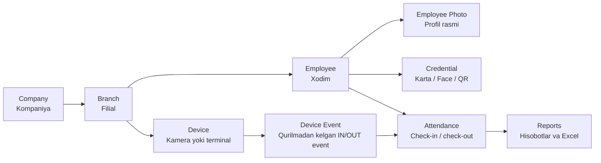
```mermaid
flowchart LR
  A["Company<br/>Kompaniya"] --> B["Branch<br/>Filial"]
  B --> C["Employee<br/>Xodim"]
  C --> D["Employee Photo<br/>Profil rasmi"]
  C --> E["Credential<br/>Karta / Face / QR"]
  B --> F["Device<br/>Kamera yoki terminal"]
  F --> G["Device Event<br/>Qurilmadan kelgan IN/OUT event"]
  C --> H["Attendance<br/>Check-in / check-out"]
  G --> H
  H --> I["Reports<br/>Hisobotlar va Excel"]
```

Oddiy qilib aytganda:

1. Avval kompaniya yaratiladi.
2. Kompaniya ichida filial yaratiladi.
3. Xodim filialga biriktiriladi.
4. Xodimga rasm va credential qo'shiladi.
5. Qurilma filialga ulanadi.
6. Xodim check-in/check-out qiladi.
7. Hisobotlar avtomatik shakllanadi.

## 2. Demo Ma'lumotlar

Demo vaqtida quyidagi qiymatlardan foydalaning.

| Bo'lim | Field | Demo qiymat | Nima uchun kerak |
|---|---|---|---|
| Login | Email | `admin@workpulse.uz` | Admin panelga kirish |
| Login | Password | `admin123` | Demo parol |
| Company | Name | `WorkPulse Demo LLC` | Tizimdagi asosiy kompaniya |
| Company | INN | `123456789` | Kompaniyani unikallashtirish |
| Branch | Name | `Main Office` | Xodimlar ishlaydigan filial |
| Branch | Radius | `100` | GPS geofence tekshiruvi uchun |
| Employee | First name | `Ali` | Xodim ismi |
| Employee | Last name | `Valiyev` | Xodim familiyasi |
| Employee | Employee code | `EMP001` | DeviceEvent orqali xodimni topish uchun |
| Employee | Position | `Operator` | Lavozim |
| Credential | Type | `CARD` yoki `FACE` | Xodimni qurilma orqali tanish usuli |
| Credential | External ID | `EMP001-CARD` | Qurilmadan keladigan credential qiymati |
| Device | Name | `HIK-001` | Kamera/terminal nomi |
| Device | Serial number | `HIK-DEMO-001` | Qurilmani unikallashtirish |
| DeviceEvent | Direction | `IN` / `OUT` | Kirish yoki chiqish hodisasi |
| DeviceEvent | Auth type | `CARD` / `FACE` | Qanday usul bilan tanilgan |

## 3. Login

Screenshot joyi:

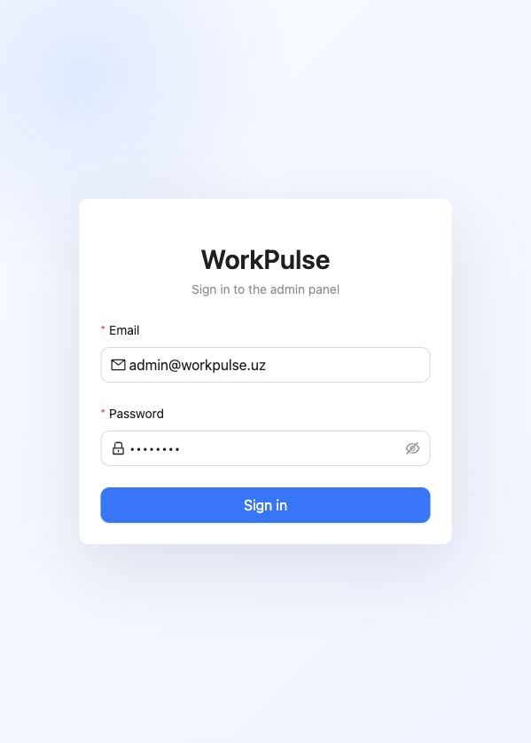

Bu sahifada admin tizimga kiradi.

Kiritiladigan qiymatlar:

| Field | Misol | Izoh |
|---|---|---|
| Email | `admin@workpulse.uz` | Dev seed orqali yaratilgan admin |
| Password | `admin123` | Demo parol |

Mijozga tushuntirish:

> "Bu admin panelga kirish sahifasi. Faqat ruxsat berilgan foydalanuvchilar tizimga kira oladi. Login qilingandan keyin barcha bo'limlar JWT token orqali himoyalanadi."

## 4. Dashboard

Screenshot joyi:

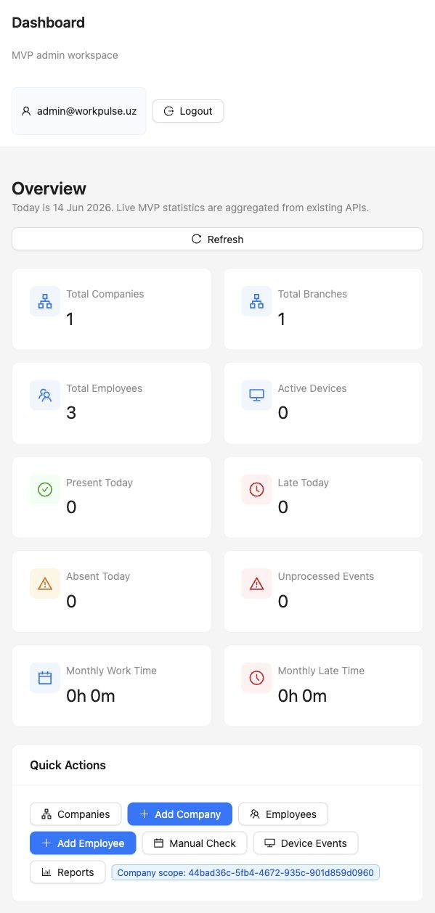

Dashboard tizim holatini tez ko'rsatadi:

| Card | Nimani bildiradi |
|---|---|
| Total Companies | Tizimdagi kompaniyalar soni |
| Total Branches | Filiallar soni |
| Total Employees | Xodimlar soni |
| Active Devices | Aktiv qurilmalar soni |
| Present Today | Bugun kelgan xodimlar |
| Late Today | Kechikkan xodimlar |
| Absent Today | Kelmagan xodimlar |
| Unprocessed Events | Hali qayta ishlanmagan device eventlar |
| Monthly Work Time | Shu oy jami ishlangan vaqt |
| Monthly Late Time | Shu oy jami kechikish vaqti |

Mijozga tushuntirish:

> "Dashboard rahbar uchun tezkor nazorat oynasi. Bu yerda bugungi davomat, aktiv qurilmalar va qayta ishlanmagan eventlar darhol ko'rinadi."

## 5. Company

Screenshot joylari:

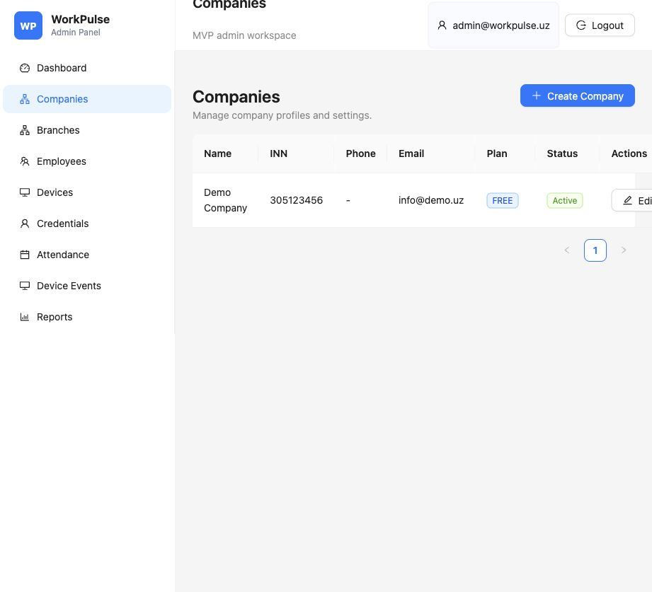
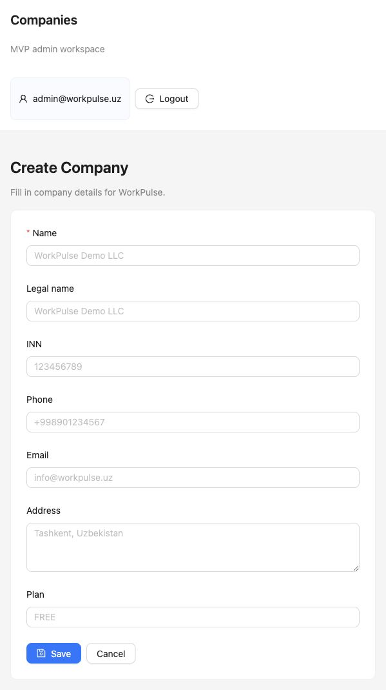

Company tizimdagi asosiy tashkilot.

Kiritiladigan qiymatlar:

| Field | Misol | Nima uchun kerak |
|---|---|---|
| Name | `WorkPulse Demo LLC` | Kompaniya nomi |
| INN | `123456789` | Unikal soliq raqami |
| Phone | `+998901234567` | Aloqa uchun |
| Email | `info@workpulse.uz` | Aloqa uchun |
| Address | `Tashkent, Uzbekistan` | Kompaniya manzili |

Company Settings:

| Field | Misol | Nima uchun kerak |
|---|---|---|
| Timezone | `Asia/Tashkent` | Davomat vaqtini to'g'ri hisoblash |
| Locale | `uz-UZ` | Til/format uchun |
| Plan | `MVP` | Tarif yoki reja uchun |

Mijozga tushuntirish:

> "Har bir mijoz kompaniya sifatida ochiladi. Kompaniyaga keyin filiallar, xodimlar va hisobotlar bog'lanadi."

## 6. Branch

Screenshot joylari:

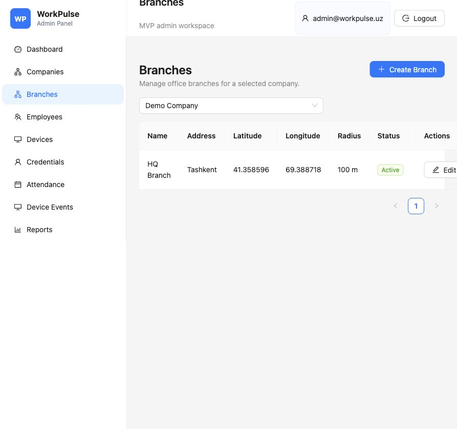
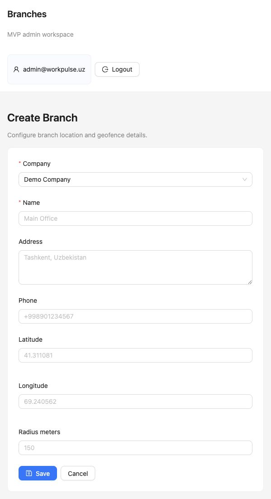
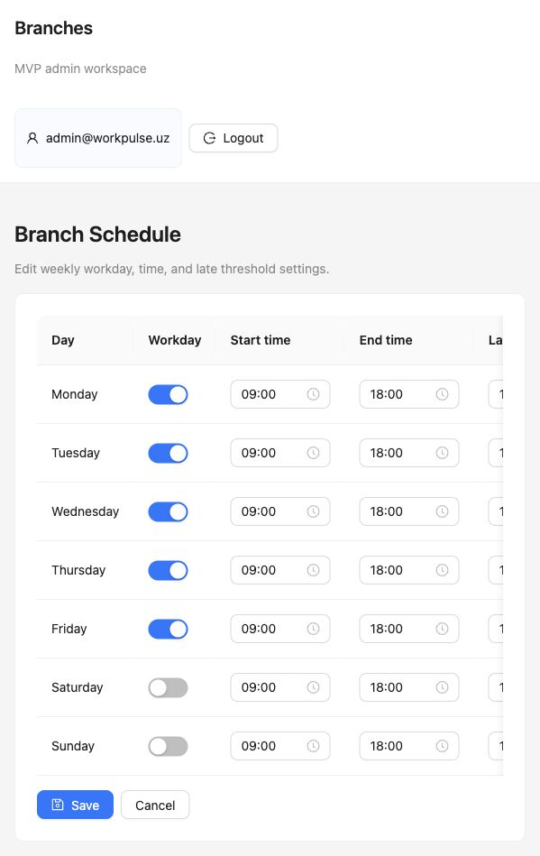

Branch kompaniyaning filial yoki ofisini bildiradi.

Kiritiladigan qiymatlar:

| Field | Misol | Nima uchun kerak |
|---|---|---|
| Company | `WorkPulse Demo LLC` | Qaysi kompaniyaga tegishli |
| Name | `Main Office` | Filial nomi |
| Address | `Tashkent, Chilanzar` | Filial manzili |
| Latitude | `41.2995` | GPS geofence uchun |
| Longitude | `69.2401` | GPS geofence uchun |
| Radius meters | `100` | Xodim shu radius ichidami tekshirish |
| Phone | `+998901112233` | Filial telefoni |

Schedule:

| Kun | Ish kuni | Start | End | Late threshold |
|---|---|---|---|---|
| Monday-Friday | Ha | `09:00` | `18:00` | `15 min` |
| Saturday-Sunday | Yo'q | `09:00` | `18:00` | `15 min` |

Mijozga tushuntirish:

> "Filial xodim qayerda ishlashini bildiradi. Ish jadvali va kechikish qoidasi filial bo'yicha belgilanadi."

## 7. Employee

Screenshot joylari:

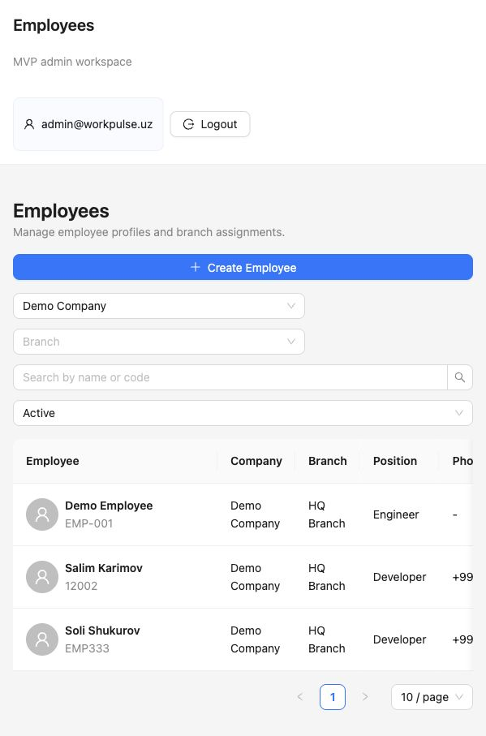
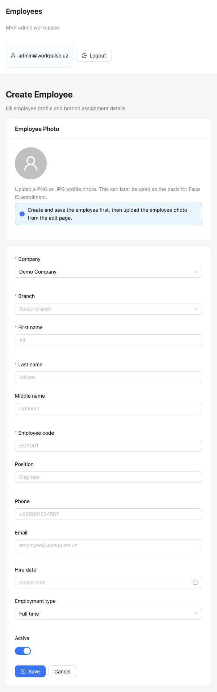
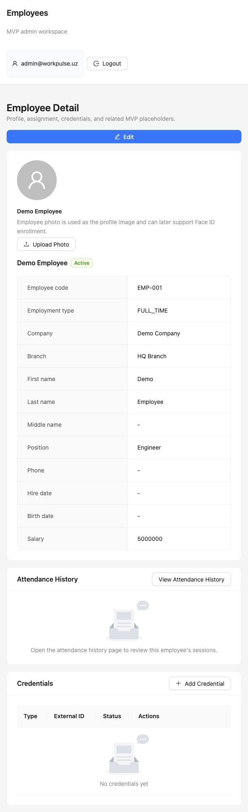
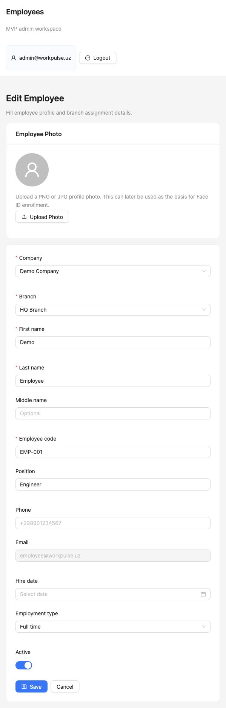

Employee kompaniya yoki filialdagi xodim.

Kiritiladigan qiymatlar:

| Field | Misol | Nima uchun kerak |
|---|---|---|
| Company | `WorkPulse Demo LLC` | Xodim qaysi kompaniyaga tegishli |
| Branch | `Main Office` | Qaysi filialda ishlaydi |
| First name | `Ali` | Xodim ismi |
| Last name | `Valiyev` | Xodim familiyasi |
| Employee code | `EMP001` | Device event orqali xodimni topish uchun juda muhim |
| Position | `Operator` | Lavozim |
| Phone | `+998901234567` | Aloqa |
| Email | `ali.valiyev@workpulse.uz` | Keyinchalik account ulash uchun |
| Hire date | `2026-06-01` | Ishga kirgan sana |
| Employment type | `FULL_TIME` | Bandlik turi |
| Active | `true` | Ishlayaptimi yoki yo'q |

Photo upload:

1. Xodimni yarating.
2. `Employees` ro'yxatida `Edit` yoki `View` bosing.
3. `Employee Photo` qismida `Upload Photo` bosing.
4. PNG/JPG rasm tanlang.

Mijozga tushuntirish:

> "Employee code qurilmadan keladigan eventlarda xodimni topish uchun ishlatiladi. Rasm esa profil uchun, keyingi bosqichda Face ID enrollment uchun asos bo'lishi mumkin."

## 8. Employee Credential

Screenshot joylari:

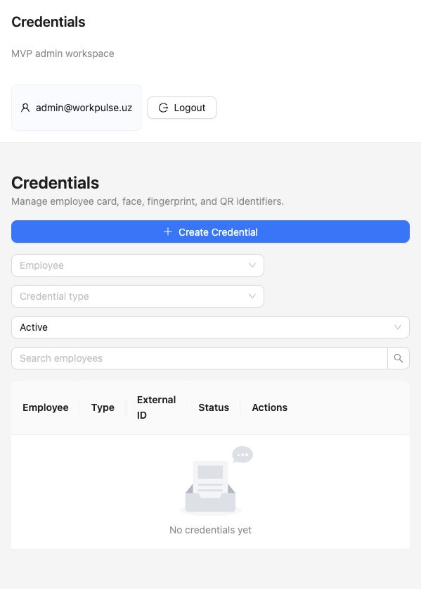
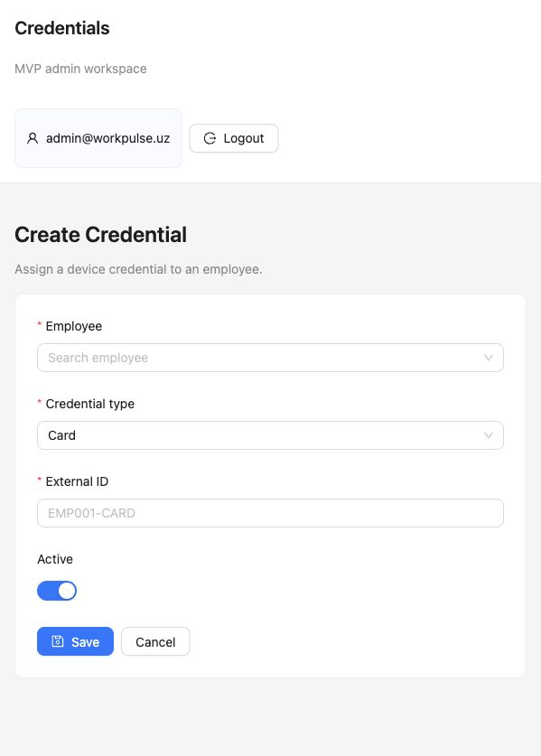

Credential xodimni qurilma orqali tanish usuli.

Kiritiladigan qiymatlar:

| Field | Misol | Nima uchun kerak |
|---|---|---|
| Employee | `Ali Valiyev` | Credential kimga tegishli |
| Credential type | `CARD`, `FACE`, `FINGERPRINT`, `QR` | Tanib olish turi |
| External ID | `EMP001-CARD` | Qurilmadan keladigan qiymat |
| Active | `true` | Credential ishlaydimi |

Mijozga tushuntirish:

> "Masalan turniket karta raqamini yuboradi. WorkPulse shu karta raqami qaysi xodimga tegishli ekanini credential orqali topadi."

## 9. Device

Screenshot joylari:

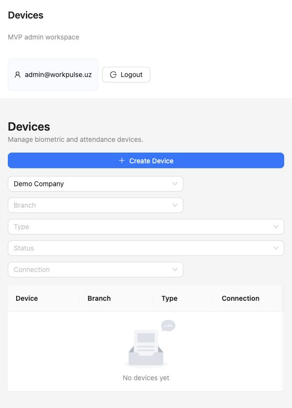
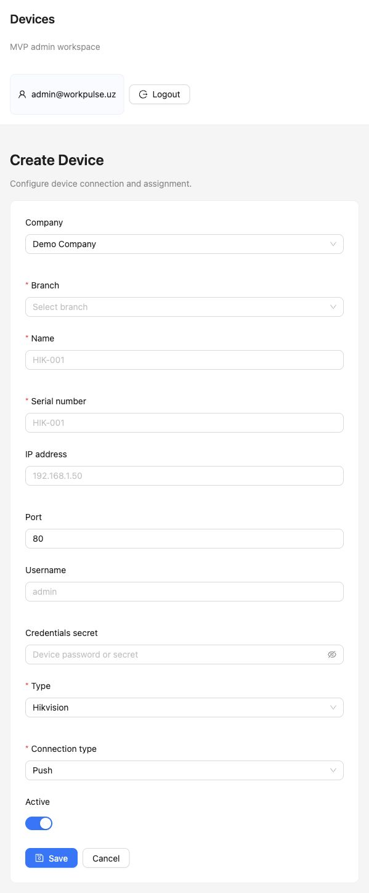

Device detail screenshot:

> TODO: demo device yaratilgandan keyin `assets/screenshots/16-device-detail.png` sifatida qo'shiladi.

Device kamera, turniket yoki biometrik terminal.

Kiritiladigan qiymatlar:

| Field | Misol | Nima uchun kerak |
|---|---|---|
| Branch | `Main Office` | Qurilma qaysi filialda |
| Name | `HIK-001` | Qurilma nomi |
| Serial number | `HIK-DEMO-001` | Qurilma unikal identifikatori |
| IP address | `192.168.1.10` | Lokal tarmoq uchun |
| Port | `80` | Qurilma porti |
| Username | `admin` | Device integration uchun |
| Credentials secret | `demo-secret` | Device parol/secret reference |
| Type | `HIKVISION` | Qurilma turi |
| Connection type | `PUSH`, `POLLING`, `ALERT_STREAM` | Event kelish usuli |
| Status | `ACTIVE` | Qurilma aktivmi |

Rotate API Key:

> API key faqat bir marta ko'rsatiladi. Device PUSH event yuborishi uchun kerak bo'ladi.

Mijozga tushuntirish:

> "Qurilma filialga bog'lanadi. Har bir event qaysi qurilmadan kelganini bilamiz, shu orqali filial davomatini nazorat qilamiz."

## 10. Attendance Manual

Screenshot joylari:

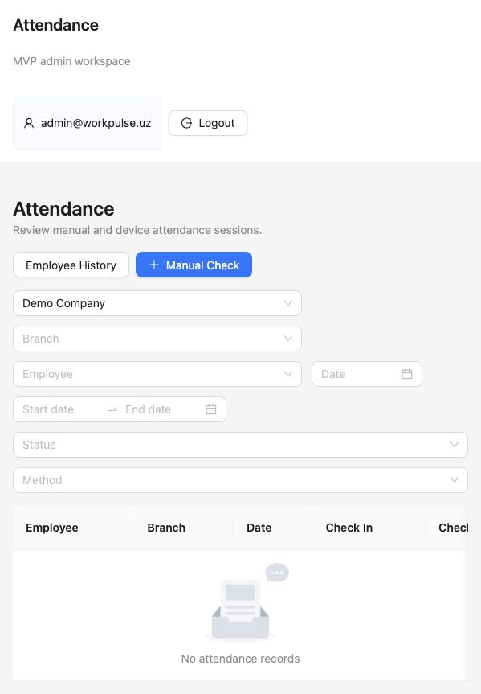
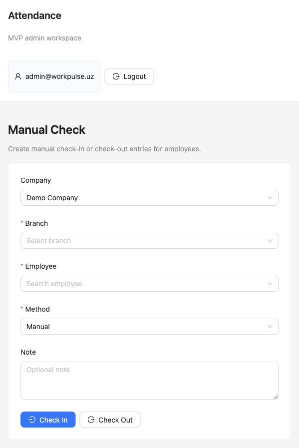

Attendance detail screenshot:

> TODO: manual check-in/check-out yoki device event processing orqali attendance record yaratilgandan keyin `assets/screenshots/19-attendance-detail.png` sifatida qo'shiladi.

Manual Check admin yoki manager tomonidan qo'lda check-in/check-out qilish uchun.

Kiritiladigan qiymatlar:

| Field | Misol | Nima uchun kerak |
|---|---|---|
| Employee | `Ali Valiyev` | Kim kiryapti/chiqyapti |
| Branch | `Main Office` | Qaysi filial |
| Method | `MANUAL` | Qo'lda kiritilganini bildiradi |
| Note | `Demo check-in` | Izoh |

Davomat statuslari:

| Status | Ma'nosi |
|---|---|
| PRESENT | Vaqtida kelgan |
| LATE | Kechikkan |
| ABSENT | Kelmagan |
| LEAVE | Ta'tilda |
| HOLIDAY | Dam olish kuni |

Mijozga tushuntirish:

> "Agar qurilma ishlamasa yoki test jarayonida bo'lsak, admin xodimni qo'lda check-in/check-out qila oladi."

## 11. Device Event

Screenshot joylari:

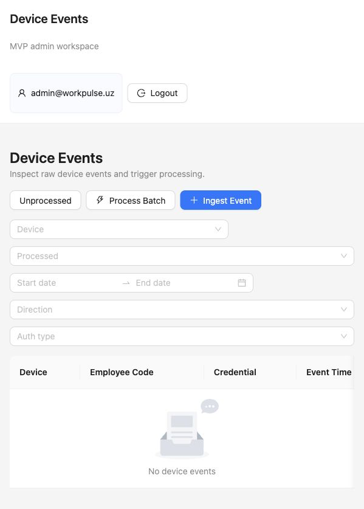
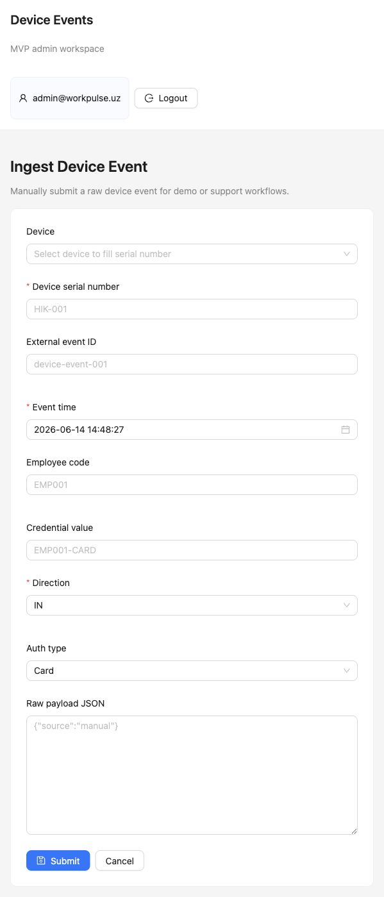
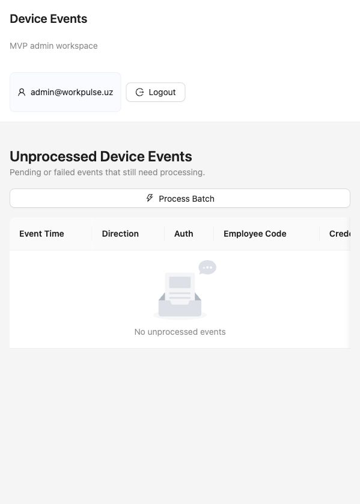

DeviceEvent qurilmadan kelgan xom hodisa.

Kiritiladigan qiymatlar:

| Field | Misol | Nima uchun kerak |
|---|---|---|
| Device | `HIK-001` | Event qaysi qurilmadan |
| External event ID | `EVT-001` | Qurilma tarafidagi event ID |
| Employee code | `EMP001` | Xodimni topish uchun |
| Credential value | `EMP001-CARD` | Credential orqali topish uchun |
| Event time | Hozirgi vaqt | Event vaqti |
| Direction | `IN` yoki `OUT` | Kirish/chiqish |
| Auth type | `CARD` yoki `FACE` | Qanday tanilgan |
| Raw payload | JSON | Qurilmadan kelgan to'liq data |

Mijozga tushuntirish:

> "Bu sahifa kamera yoki terminaldan kelgan xom ma'lumotlarni ko'rsatadi. Process qilinganda event davomatga aylanadi."

## 12. Reports

Screenshot joylari:

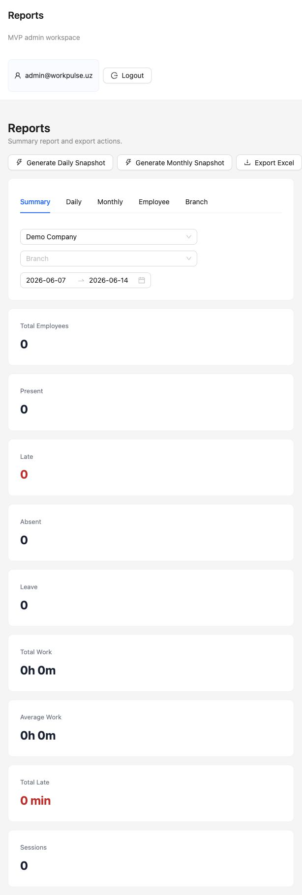
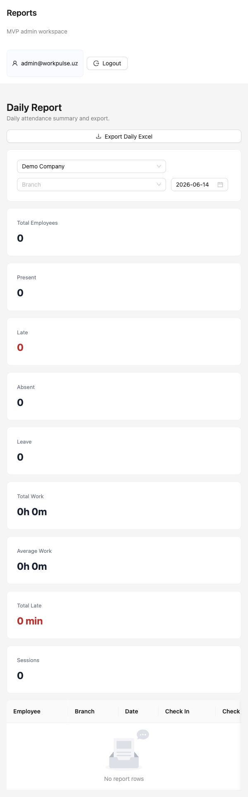
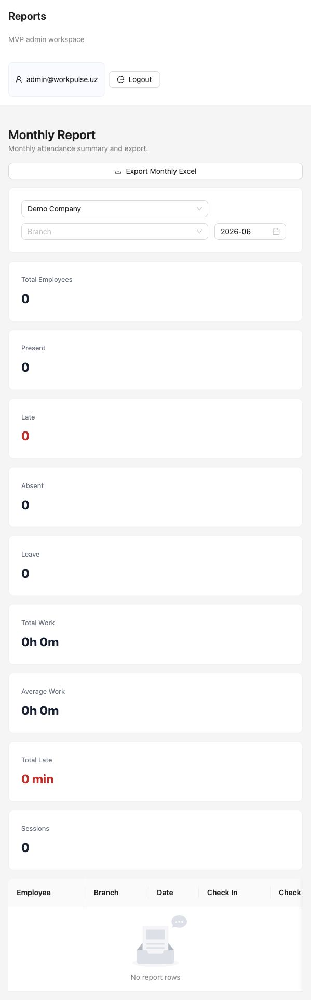
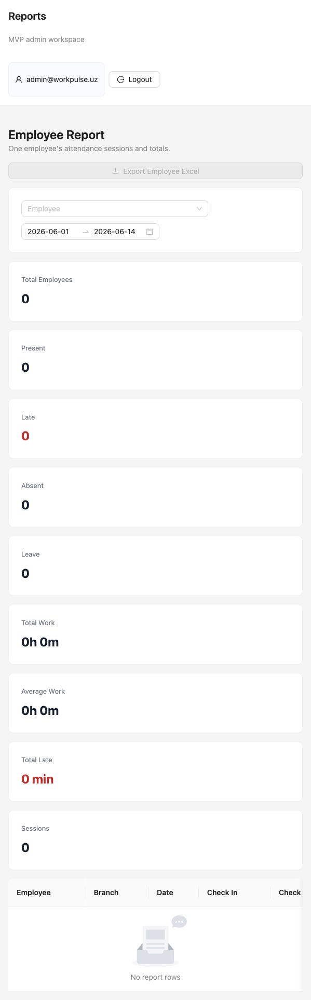
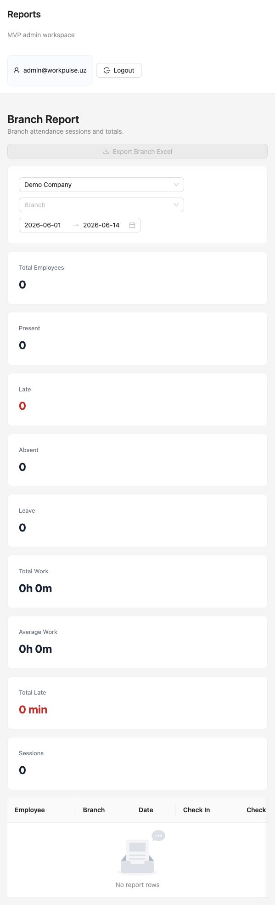

Reportlar rahbar va HR uchun natijani ko'rsatadi.

Report turlari:

| Report | Nima ko'rsatadi |
|---|---|
| Summary | Umumiy davomat statistikasi |
| Daily | Bitta kun bo'yicha davomat |
| Monthly | Oy bo'yicha jamlanma |
| Employee | Bitta xodim tarixi |
| Branch | Bitta filial davomat tarixi |

Excel export:

> Hisobotlarni `.xlsx` qilib yuklab olish mumkin. Bu buxgalteriya yoki HR tizimiga topshirish uchun qulay.

Mijozga tushuntirish:

> "Rahbar kunlik, oylik, xodim yoki filial kesimida hisobot oladi. Excel export orqali ma'lumot tashqarida ham ishlatiladi."

## 13. Bitta To'liq Demo Flow

Quyidagi tartibda mijozga ko'rsating:

1. Login qiling.
2. Dashboardni ko'rsating.
3. Company yarating: `WorkPulse Demo LLC`.
4. Branch yarating: `Main Office`.
5. Branch schedule ochib ish vaqtini ko'rsating.
6. Employee yarating: `Ali Valiyev`, `EMP001`.
7. Employee edit/detaildan photo upload qiling.
8. Credential yarating: `CARD`, `EMP001-CARD`.
9. Device yarating: `HIK-001`.
10. Manual check-in qiling.
11. Manual check-out qiling.
12. DeviceEvent ingest qiling: `IN`, `FACE` yoki `CARD`.
13. Process qiling.
14. Attendance listda natijani ko'rsating.
15. Reports summary oching.
16. Excel export qiling.

## 14. Qisqa Mijozcha Tushuntirish

> "WorkPulse xodimlarning ishga kelish-ketishini avtomatlashtiradi. Kompaniya o'z filiallarini yaratadi, xodimlarni biriktiradi, kamera yoki terminal qurilmalarini ulaydi. Xodim karta, Face ID yoki boshqa credential orqali kirganda event tizimga tushadi va davomat avtomatik hisoblanadi. Rahbar esa dashboard va reportlar orqali bugungi holat, kechikishlar, ishlangan vaqt va xodimlar tarixini ko'radi."
